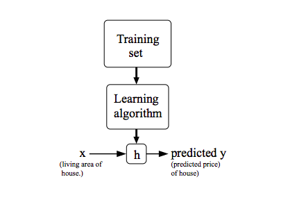

# Model Representation

In this section will coverup all the notations that we are going to use throughout the course.

For this let us take an example, here we have data related to the land area and its price. So, let say our program job is to take area from a user and predict what will be the cost of that land.

| Area | Price (in 1000$) |
|------|-------|
| 500 | 100 |
| 600 | 200 |
| 700 | 300 |
| 800 | 400 |
| 900 | 500 |

Here the input variable for us is **area** and output variable is the **price** of that land. Notation for the input and output will be as follows:

**x(i)**: Input value.  
**y(i)**: Output value.  
**(x(i), y(i))**: ith Training example.  
**m**: Total no. of dataset that we have.  
**Y**: Space of input values.  
**X**: Space of output values.  

Here is process for generating a **hypothesis** function.

TODO: *Write a simple and elobrated explaination for the above diagram*

**How do we represent h?**

h&theta;(x) =  &theta;0 + &theta;1.x

This model is known as **Linear Regression with One Variable** or **Univariate Linear Regression** model.
