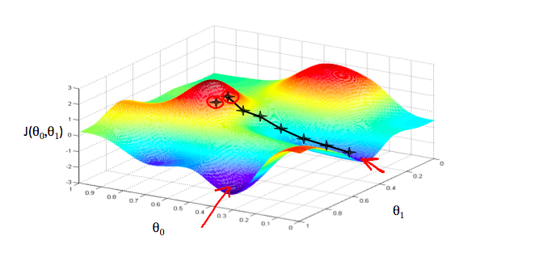

# Gradient Descent

**Gradient descent** is an algorithm used for minimizing cost function. This algorithm is used in all over the place in ML.

We have some function J(&theta;0, &theta;1)
We want to minimize the above function.

In gradient descent these are the steps that we need to follow:

- Start with some &theta;0, &theta;1
- Keep changing &theta;0, &theta;1 to reduct j(&theta;0, &theta;1) until we reach the minimum point

Let's take this graph

*This graph is from coursera ml course*

Here we have different minimum points in the graph let's call them local minimum point and there Will be also the least minimum point in this graph we will call in global minimum point.

## Step in Gradient Descent

- First let's take any point in the graph. It is denoted by a cross.
- Then we will find the derivative of the cost funtion i.e. slope of the tangent from that point
- The slope of the tangent will give us the direction to move toward.
- The size of step is determine by the parameter &alpha;. This means that if the value of &alpha; is larger the step taken will be larger too and if the value of &alpha; is smaller that the step will me smaller.
- The direction in whihch step is taken is determined by the partial derivative of cost function.
- Depending on where your starting point is you may end up in a different minimum point.

## Algorithm for Gradient Descent

repeat until convergence:

&theta;j := &theta;j - &alpha &part;/(&part;&theta;j).J(&theta;0), &theta;1

where j = 0,1 represent the feature index number.

>All the parameters should be update simultaneously
i.e
first use j=0 in the gradient descent
then use j=1 in the gradient descent
now set the value's for both the theta
