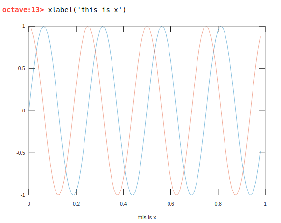

# Plotting Data

**Let's take two variable and plot them in octave**


**To plot on top of the current plotted data**


**Labeling**




**Saving the current graph**

```
>>> print -dpng 'some_name.png'
```

**To close the current plotted data**

```
>>> close
```

**Plotting different data on different graph**

```
>>> figure(some_int)
>>> plot(x, y)
>>> close some_int
```

**Subplotting**


**Changing axis**


**Clear plotted graph**

```
>>> clf;
```

TODO: *Add details about imagesc()*