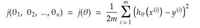

# Gradient Descent With Multiple Features

Cusrrently our hypothesis is,

h&theta;(x) = &theta;TX = &theta;0x0 + &theta;1x1 + &theta;2x2 + ... + &theta;nxn

and, parameters = &theta;0, &theta;1, ..., &theta;n = &theta;

So our cost function will be now

gradient descent

and for multiple features

