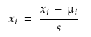

# Feature Scaling

In feature scaling we make sure that all the features are on a similar scale.

for example,

let, x1 = size of house = 0 - 2000
and, x2 = no. of bedroom = 0 - 5

If we plot cost function graph for this the graph will be very skinny as given in the image below. If we run gradient descent on this cost function, it will take long time to find the minimum value.

To fix this issue we can scale the feature. for that we can use this fourmular

where

xi = particular traniee input value  
s = size of range of values

for the above example s for x1 will be 2000 and for x2 will be 5.

So, our goal in feature scaling should be to get every feature into apporiximate of  
-1 &#8804; xi &#8804; 1

We can also use **mean normalisation** to scale feature.

here

&#956; is the average of all the values for feature xi

