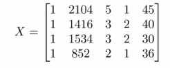
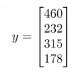

# Normal Equation

Till now we were using gradient descent which was iterating continously to find the minimum value for the cost function.  

The normal equation equation method solves for &theta; analytically i.e. we will not need to iterate over some values.  

let, J(&theta;) = a&theta;2 + b&theta; + c

we can minimize this by taking it's derivative and keeping it equal to 0  

d/d&theta;(J(&theta;)) = 0

but, as we know our &theta; is a n+1 dimension parameters

i.e. J(&theta;) = J(&theta;0, &theta;1, &theta;2, ..., &theta;n)

to minimize this we can take partial differentiation of J(&theta;).

let take the following data  

| x0 | Size(feet2) | No. of bedroom | No. of floors | Age of home (years) | Price($1000) |
|-------|-------|-------|-------|-------|-------|
| 1 | 2104 | 5 | 1 | 45 | 460 |  
| 1 | 1416 | 3 | 2 | 40 | 232 |  
| 1 | 1534 | 3 | 2 | 30 | 315 |  
| 1 | 852  | 2 | 1 | 36 | 178 |  

here we have:  
m = 4  
n = 4  
x1 = Size  
x2 = No. of bedroom  
x3 = No. of floors  
x4 = Age of home  
y = Price  

in this, our **X** matrix will be  

X is a m x (n+1) dimension matrix  

and **y** vector will be  

y is m dimension vector  

So, If we take the X and y, and compute the below equation you will get the value of &theta; that will minimize your cost function.  

&theta; = (XTX)-1XTy

## Pros and Cons

**Gradient Descent**

    - **pros**
        - Works well even when n is larger

    - **cons**
        - Need to choose learning rate
        - needs many iteration.

**Normal Equation**

    - **pros**
        - No need to choose learning rate.
        - Don't need to iterate.

    - **cons**
        - Need to compute the inverse of X transpose and X.
        - Slow if n is very large.
