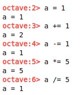

# Basic Operations

## Arthemic Operation

If you add *semicolon(;)* at the end, then it will not display the output.

To add comment use *percent(%)*.

## Assigning variable

## Print / Display

## Changing Format

## Matrix

Creating a normal matrix  

*semicolon(;) tells the end of row.*  

Using **start_value:increment_value:end_value** to create matrix

Creating a matrix containing only ones using **ones()**  

Generating matrix containing only zeros using **zeros(rows, cols)** function.  

Matrix with random numbers

Generating indentity matrix

    If you want to run octave code online <a href="https://octave-online.net/">click here</a> 
    (use ctrl to open link in new tab &#128077;)

