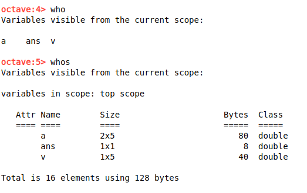
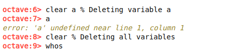

# Moving Data Around

In this portion we will see how can we load data from a data file.  

printing the location  

```
>>> pwd
```

printing the list of files/folder in the current location.

```
>>> ls
```

let's take a file *some_name.dat* that contains the data. To load data from that file.

```
>>> load some_name.dat
```

or

```
>>> load('some_name.dat')
```

To see what variables you do have in your octave you can use either **who** or **whos**.



To clear a singal or all **variables**.



Saving variables to file.

```
>>> save file_name.mat variable_name;
>>> save file_name.txt variable_name -ascii;
```