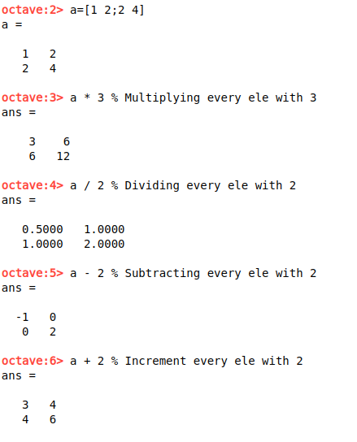
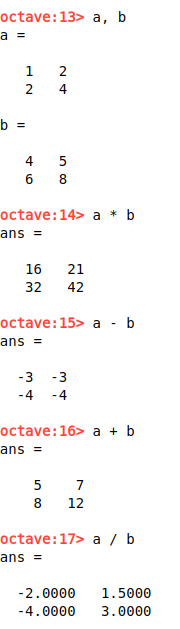
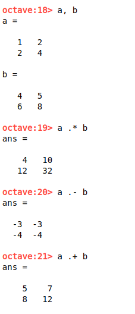

# Computation On Data

**Arthemetic operations on matrix with single ele**



**Arthemetic operations on matrix with matrix**



**Element wise matrix operations**



*You can use division(/) power(^) similarly.*

**Useful functions**

```
>>> abs(matrix/vector)
>>> log(matrix/vector)
>>> exp(matrix/vector)
>>>  
>>> max(matrix/vector)
>>> [val, ind] = max(matrix/vector)
>>>
>>> [row, col] = find(matrix < some_int)
>>>
>>> sum(matrix/vector)
>>> floor(matrix/vector)
>>> ceil(matrix/vector)
>>> rand(matrix/vector)
>>>
>>> pinv(matrix/vector) % Getting inverse
>>>
>>> matrix' % Gives the transpose 
```

There are many more function that octave have you either search and explore them <a href="https://octave.sourceforge.io/list_functions.php">here</a>. 