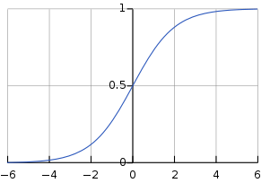

# Hypothesis Representation
  
In this we will see the function that we are going to use to represent our **hypothesis** function for a **classification problem**.  
  
earlier in **linear regression** we want, 0 &ge; h&theta; &le; 1  
  
In **linear regression** h&theta; = &theta;Tx  
  
for **classification** h&theta; = g(&theta;Tx)  
  
where the function **g** is known as a **Sigmoid** or **Logistic** function,
  
Here is a representation of **Sigmoid/Logistic function** on graph.  

  
g(z) = 1 / (1+e-z)  
  
*here z is a real number*  
  
*so the hypothesis for classification problem will be*  
  
h&theta; = 1 / (1+e-&theta;Tx)  

so, our hypothesis is the probability that y is equal to 0/1 for given x parameterized bt &theta;

i.e. h&theta; = P(y=1|x; &theta;)

# Example

Let's take the tumor example. In that, let's say we have a feature x i.e. tumor size.  

Now let's assume that our hypothesis for a particular tumor size is 0.7  

i.e. h&theta; = 0.7

so, the above hypothesis conclude that the chance of a tumor being maligant is 70%

# Useful Links

- [Sigmoid Function](https://en.wikipedia.org/wiki/Sigmoid_function)
